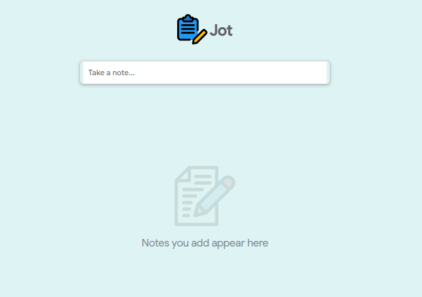
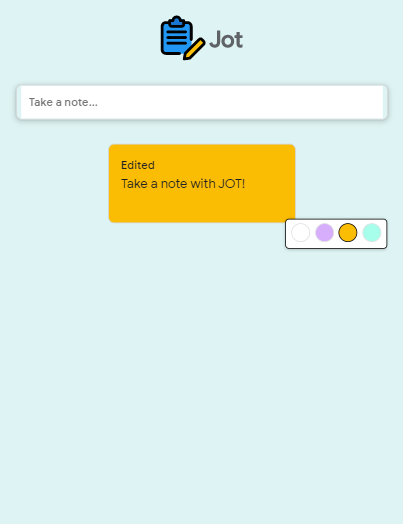

### JOT

A note taking app. 

##### Features
- Users can add, update and delete notes
- Users can change a notes background color by choosing 4 available colors from the tooltip
- Notes are stored in local storage

##### Screenshots

 

 
  
##### Credits

###### App Logo

Icons made by <a href="https://icon54.com/" title="Pixel perfect">Pixel perfect</a> from <a href="https://www.flaticon.com/" title="Flaticon">www.flaticon.com</a>

###### Delete Icon

Icons made by <a href="https://www.flaticon.com/authors/bqlqn" title="bqlqn">bqlqn</a> from <a href="https://www.flaticon.com/" title="Flaticon">www.flaticon.com</a>

###### Palette Icon

Icons made by <a href="https://www.flaticon.com/authors/freepik" title="Freepik">Freepik</a> from <a href="https://www.flaticon.com/" title="Flaticon">www.flaticon.com</a>

##### Technologies used

||||
|---|---|---|---|
|[JavaScript](https://developer.mozilla.org/en-US/docs/Web/JavaScript)|[HTML5](https://developer.mozilla.org/en-US/docs/Web/Guide/HTML/HTML5)|[CSS3](https://developer.mozilla.org/en-US/docs/Archive/CSS3)|
